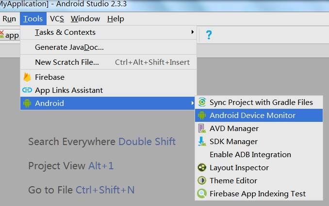
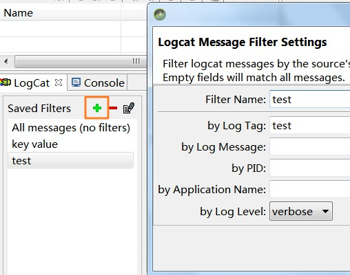

# Method

## windows下使用android audio进行调试

###打开Tools-Android-Android Device Monitor

Android Device Monitor是Google SDK套件中的一个调试工具。里面包含了好几种调试工具，包括DDMS、Hierarchy View、Debug、Tracer for OpenGL ES、Pixel Perfect，其中通过DDMS开发人员可以通过他看到目标设备上运行的程序，可以查看内存分配情况，可以模拟向设备打电话发短信还可以发送地理信息位置。

##配置
###设置filter信息

###windows-preferences配置logcat缓存条数
以便方便选中，不会被刷新掉
