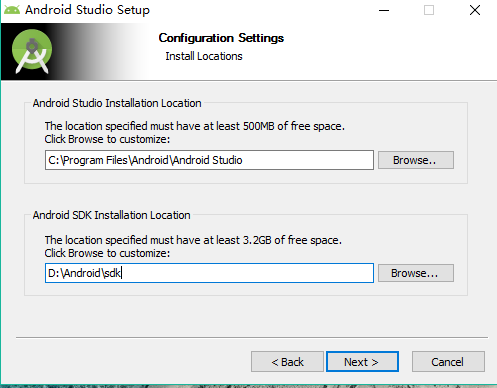

# Setup

## 手机相关配置

- 开启usb调试

- 选中MTP方式连接，而非充电模式

- 可能要跑一便adb`adb devices`，但是记住跑完后要去掉adb进程，避免端口占用的错误。

## 安装Visual Studio

下载[Android Developer官网](http://developer.android.com/sdk/installing/studio.html)需要翻墙，并安装。

